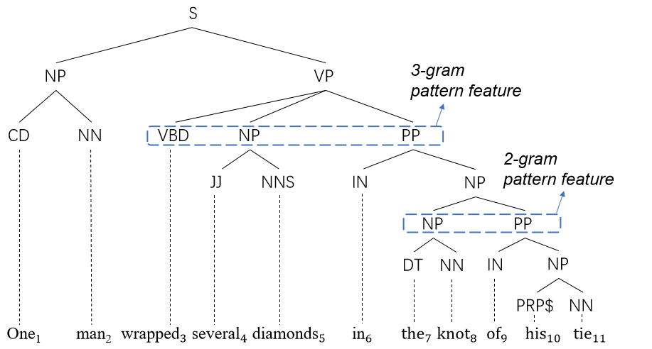

# NFC

This repository is the PyTorch implementation of our ACL-2022 [paper]

Source code for Investigating Non-local Features for Neural Constituency Parsing.

## Contents
1. [Introduction](#Introduction)
2. [Usage](#usage)
3. [Citation](#citation)
4. [Credits](#credits)

## Introduction

We inject non-local sub-tree structure features to chart-based constituency parser by introducing two auxiliary training objectives.

### Instance-level Pattern Loss

We define pattern as the n-gram constituents sharing the same parent, and ask model to predict the pattern based on span representation.

### Corpus-level Consistency Loss
The consistency loss regularizes the co-occurrence between constituents and pattern by collecting corpus-level statistics.


NFC is developed on the basis of [Self-Attentive Parser](https://arxiv.org/abs/1805.01052), whose code base is at [this url](https://github.com/nikitakit/self-attentive-parser).

## Usage

### To run our code:
```bash
$ pip install -r requirement.txt
```

### For test:
```
python src/export test \
    --pretrained-model-path "bert-large-uncased" \
    --model-path path-to-the-checkpoint\
    --test-path path-to-the-test-file
```
If for Chinese, add '''--text-processing chinese''' and change the --pretrained-model-path. 

We release our model checkpoints at Google Drive. (Models for [PTB](https://drive.google.com/file/d/1GD-u3CIxRz20bFjhaYGOVJtyt8Patwz-/view?usp=sharing) and for [CTB5.1](https://drive.google.com/file/d/1vpGTii40PgOllAen43CzNNeWprO4fMCn/view?usp=sharing).)


### To train a new parser:

For English:
```bash
$ RANDOM_SEED=42
$ python src/main.py train \
    --train-path data/02-21.10way.clean \
    --dev-path data/22.auto.clean \
    --subbatch-max-tokens 500 \
    --use-pretrained --pretrained-model bert-large-uncased  \
    --use-encoder --num-layers 2 \
    --max-consecutive-decays 10 --batch-size 64 \
    --use-pattern --pattern-num-threshold 5 --num-ngram "3" --pattern-loss-scale 1.0 \
    --use-compatible  --compatible-loss-scale 5.0 \
    --numpy-seed ${RANDOM_SEED} \
    --model-path-base models/ptb_bert_tri-task_negative-5_scale-5_${RANDOM_SEED}
```

For Chinese:
```bash
$ RANDOM_SEED=42
$ python src/main.py train \
--train-path data/ctb_5.1/ctb.train \
--dev-path data/ctb_5.1/ctb.dev \
--subbatch-max-tokens 500 \
--use-pretrained --pretrained-model pretrained_models/bert-base-chinese \
--max-consecutive-decays 10 --batch-size 32 \
--use-pattern \
--frequent-threshold 0.005 --num-ngram "2" --pattern-loss-scale 1.0 \
--use-compatible --compatible-loss-scale 5.0 \
--numpy-seed ${RANDOM_SEED} \
--text-processing chinese --predict-tags \
--model-path-base models/ctb_bert_tri-task_negative-5_scale-5_${RANDOM_SEED}
```


## Citation

If you use this software for research, please cite our papers as follows:

```

```

## Credits

The code in this repository is developed on the basis of the released code from https://github.com/mitchellstern/minimal-span-parser and https://github.com/nikitakit/self-attentive-parser.
